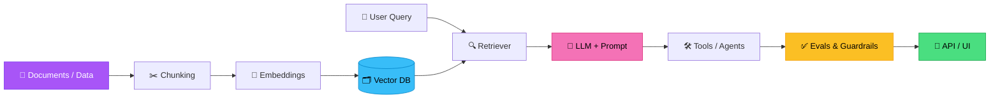

<!-- ===================== HERO ===================== -->
<p align="center">
  
</p>

<!-- ===================== TYPING ANIMATION ===================== -->
<p align="center">
  
</p>

<!-- ===================== BADGES ===================== -->
<p align="center">
  
  
  
</p>

<p align="center">
  
  
</p>

<!-- ===================== ABOUT ME ===================== -->
<div align="center">

## 👋 Hey, I'm **Gautam Keshri**

### 🎓 B.Sc. (Hons) – Data Science & Artificial Intelligence
### 🏛️ Indian Institute of Technology (IIT) Guwahati

</div>

<table align="center">
<tr>
<td width="50%">

```python
class GautamKeshri:
    def __init__(self):
        self.role = "AI Engineer (Intern)"
        self.education = "IIT Guwahati – DS & AI"
        self.focus = ["LLMs", "RAG", "AI Agents",
                      "Fine-Tuning", "LLMOps"]
        self.languages = ["en_US", "hi_IN"]

    def say_hi(self):
        print("Thanks for dropping by! "
              "Let's build AI that actually ships 🚀")

me = GautamKeshri()
me.say_hi()
```

</td>
<td width="50%">

### ⚡ Quick Facts

🔹 I build **LLM-powered apps** end to end  
🔹 Hands-on with **RAG pipelines & vector search**  
🔹 Exploring **AI agents & tool calling**  
🔹 Care about **evals, latency & cost**, not just demos  

> 💡 *"A model is only useful once it's in someone's hands."*

</td>
</tr>
</table>

<!-- ===================== TECH STACK ===================== -->
## 🛠️ Tech Stack

<div align="center">

### 🧠 Generative AI & LLMs
<p>
  
  
  
  
  
  
  
  
</p>

### 🗂️ Vector Databases & Retrieval
<p>
  
  
  
  
  
</p>

### 🤖 Deep Learning & ML
<p>
  
  
  
  
  
  
</p>

### 🚀 Deployment, APIs & MLOps
<p>
  
  
  
  
  
  
  
</p>

</div>

<!-- ===================== HOW I BUILD ===================== -->
## 🧩 How I Build GenAI Systems

<div align="center">


```mermaid
graph LR
    A[📄 Documents / Data] --> B[✂️ Chunking]
    B --> C[🔢 Embeddings]
    C --> D[(🗂️ Vector DB)]
    Q[💬 User Query] --> E[🔍 Retriever]
    D --> E
    E --> F[🧠 LLM + Prompt]
    F --> G[🛠️ Tools / Agents]
    G --> H[✅ Evals & Guardrails]
    H --> I[🚀 API / UI]

    style A fill:#a855f7,stroke:#7c3aed,color:#fff
    style D fill:#38bdf8,stroke:#0284c7,color:#000
    style F fill:#f472b6,stroke:#db2777,color:#000
    style H fill:#fbbf24,stroke:#f59e0b,color:#000
    style I fill:#4ade80,stroke:#16a34a,color:#000
```

</div>

<!-- ===================== WHAT I BUILD ===================== -->
## 🎯 What I Work On

<table>
<tr>
<td width="50%" valign="top">

### 🧠 Generative AI
- 📚 **RAG pipelines** (hybrid search, re-ranking)
- 🤖 **AI agents** with tool / function calling
- 🎛️ **Fine-tuning** open models (LoRA / QLoRA)
- ✍️ **Prompt engineering** & structured outputs
- 🖼️ **Multimodal** apps (text + image)

</td>
<td width="50%" valign="top">

### ⚙️ AI Engineering
- 🌐 **LLM APIs** served with FastAPI
- 📏 **Evaluation** of LLM outputs (RAGAS, custom evals)
- 🛡️ **Guardrails** & hallucination reduction
- 💸 **Latency & cost** optimisation, caching
- 🐳 **Containerised deployment** on the cloud

</td>
</tr>
</table>

<!-- ===================== FEATURED PROJECTS ===================== -->
## 🚀 Featured Projects

<!-- ✏️ Replace these with your real projects. Keep 3–4 strong ones.
     A recruiter should see: what it does, the stack, and one number (latency, accuracy, users, etc.) -->

| Project | What it does | Stack |
|:---|:---|:---|
| 📚 **[Project Name – RAG Assistant](https://github.com/Gautam825406/REPO)** | Chat with PDFs/docs using retrieval-augmented generation with source citations | LangChain · FAISS · FastAPI · Streamlit |
| 🤖 **[Project Name – AI Agent](https://github.com/Gautam825406/REPO)** | Agent that uses tools (search, calculator, SQL) to answer multi-step questions | LLM API · Function Calling · Python |
| 🎛️ **[Project Name – Fine-Tuned LLM](https://github.com/Gautam825406/REPO)** | Fine-tuned an open-source model on a domain dataset with LoRA | Hugging Face · PEFT · PyTorch |
| 🏥 **[Hospital Database Migration Automation](https://github.com/Gautam825406/A-Hospital-Database-Migration-Automation-System)** | Automated database migration pipeline | Python · SQL |

<!-- ===================== GITHUB STATS ===================== -->
## 📊 GitHub Analytics

<p align="center">
  
  
</p>

<p align="center">
  
</p>

<p align="center">
  
</p>

<!-- ===================== CAREER DIRECTION ===================== -->
## 🧭 Career Direction

<table align="center">
<tr>
<td width="50%" valign="top">

### 🔍 Target Roles
- 🧠 **Generative AI Intern**
- 🤖 **AI Engineer Intern**
- 📚 **LLM / NLP Engineer Intern**
- 🛠️ **ML Engineer Intern**

</td>
<td width="50%" valign="top">

### 🌱 Currently Leveling Up
- 🤝 **Multi-agent systems** & MCP
- 🎛️ **LLM fine-tuning** (LoRA, DPO)
- 📏 **LLM evaluation & observability**
- ☁️ **LLMOps** on AWS
- ⚡ **Inference optimisation** (quantisation, vLLM)

</td>
</tr>
</table>

<!-- ===================== CONNECT ===================== -->
## 🤝 Let's Connect

<p align="center">
  <a href="https://www.linkedin.com/in/gautam-keshri">
    
  </a>
  <!-- ✏️ Put your real email address after mailto: -->
  <a href="mailto:YOUR_EMAIL@gmail.com">
    
  </a>
  <a href="https://github.com/Gautam825406">
    
  </a>
  <a href="https://www.kaggle.com/keshrigautam2000">
    
  </a>
  <a href="https://huggingface.co/YOUR_HF_USERNAME">
    
  </a>
</p>

<div align="center">

### 💼 Open to GenAI & AI Engineering Internships

*Looking for a team where I can build, ship and learn from real LLM products.  
Let's build something intelligent together!* 🚀

</div>

<!-- ===================== SNAKE ===================== -->
<div align="center">

### 🐍 Watch My Contributions Get Eaten!

<picture>
  <source media="(prefers-color-scheme: dark)" srcset="https://raw.githubusercontent.com/Gautam825406/Gautam825406/output/github-contribution-grid-snake-dark.svg">
  <source media="(prefers-color-scheme: light)" srcset="https://raw.githubusercontent.com/Gautam825406/Gautam825406/output/github-contribution-grid-snake.svg">
  
</picture>

</div>

<!-- ===================== FOOTER ===================== -->
<p align="center">
  
</p>
