<!-- ===================== ULTRA ANIMATED HERO ===================== -->
<p align="center">
  
</p>

<!-- ===================== TYPING ANIMATION ===================== -->
<p align="center">
  
</p>

<!-- ===================== PROFILE VIEWS & SOCIAL PROOF ===================== -->
<p align="center">
  
  
  
</p>

<p align="center">
  
  
  
</p>


<!-- ===================== ABOUT ME SECTION ===================== -->
<div align="center">

## 🌟 Hey There! I'm **Gautam Keshri** 👨‍💻

### 🎓 B.Sc. (Hons) – Data Science & Artificial Intelligence
### 🏛️ Indian Institute of Technology (IIT), Guwahati

</div>

<table align="center">
<tr>
<td width="50%">

```python
class GautamKeshri:
    def __init__(self):
        self.name = "Gautam Keshri"
        self.role = "Data Scientist"
        self.education = "IIT Guwahati"
        self.language_spoken = ["en_US", "hi_IN"]
    
    def say_hi(self):
        print("Thanks for dropping by! 
               Let's turn data into impact!")

me = GautamKeshri()
me.say_hi()
```

</td>
<td width="50%">

### 🚀 Quick Facts

🔹 **Passionate** about Data Analytics & ML  
🔹 **Love** solving real-world problems  
🔹 **Focus** on impact & storytelling  
🔹 **Believer** in data-driven decisions  

> 💡 *"Data is valuable only when it drives action"*

</td>
</tr>
</table>


<!-- ===================== TECH STACK ===================== -->
## 🛠️ My Arsenal of Tools & Technologies

<div align="center">

### 📊 Data Analysis & Visualization
<p>
  
  
  
  
  
  
</p>

### 🗄️ Database & Query Languages
<p>
  
  
  
  
</p>

### 🤖 Machine Learning & AI
<p>
  
  
  
  
  
</p>

### 📊 BI & Reporting Tools
<p>
  
  
  
  
</p>

### ⚙️ Tools & Platforms
<p>
  
  
  
  
  
  
  
</p>

</div>


<!-- ===================== WORKFLOW SECTION ===================== -->
## 📈 My Data Science Workflow

```mermaid
graph LR
    A[📥 Data Collection] --> B[🧹 Data Cleaning]
    B --> C[🔍 EDA & Analysis]
    C --> D[📊 Visualization]
    D --> E[💡 Insights]
    E --> F[🚀 Business Impact]
    
    style A fill:#38bdf8,stroke:#0284c7,color:#000
    style B fill:#22d3ee,stroke:#0891b2,color:#000
    style C fill:#a78bfa,stroke:#7c3aed,color:#000
    style D fill:#fb923c,stroke:#ea580c,color:#000
    style E fill:#fbbf24,stroke:#f59e0b,color:#000
    style F fill:#4ade80,stroke:#16a34a,color:#000
```

<div align="center">



</div>

<!-- ===================== WHAT I BUILD ===================== -->
## 🎯 What I Build

<table>
<tr>
<td width="50%" valign="top">

### 🔬 Analytics Projects
- 📊 **Exploratory Data Analysis (EDA)**
- 📈 **Business Intelligence Dashboards**
- 📉 **Trend Analysis & Forecasting**
- 🎲 **Statistical Hypothesis Testing**
- 📐 **A/B Testing & Experimentation**

</td>
<td width="50%" valign="top">

### 🤖 ML/AI Projects
- 🎯 **Predictive Modeling**
- 🔍 **Classification & Regression**
- 🌳 **Ensemble Methods**
- 🧠 **Deep Learning Applications**
- 💬 **Natural Language Processing**

</td>
</tr>
</table>


<!-- ===================== GITHUB STATS ===================== -->
## 📊 GitHub Analytics

<p align="center">
  
  
</p>

<p align="center">
  
</p>

<p align="center">
  
</p>

<!-- ===================== TROPHIES ===================== -->
<p align="center">
  
</p>


<!-- ===================== HIGHLIGHTS ===================== -->
## 🏆 Key Highlights

<div align="center">

| 🎯 **Focus Area** | 📊 **Achievement** |
|:---|:---|
| 🔬 **Projects Completed** | 15+ Real-world Analytics & ML Projects |
| 📈 **Model Accuracy** | Average 87% across classification tasks |
| 💼 **Business Impact** | Delivered actionable insights to stakeholders |
| 📚 **Continuous Learning** | Active on Kaggle, Coursera & DataCamp |
| 🤝 **Collaboration** | Strong team player with presentation skills |

</div>

<!-- ===================== CAREER GOALS ===================== -->
## 🎯 Career Direction

<table align="center">
<tr>
<td width="50%" valign="top">

### 🔍 Target Roles
- 📊 **Data Analyst Intern**
- 🤖 **Data Science Intern**
- 🚀 **Junior Data Scientist**
- 📈 **Business Intelligence Analyst**
- 🧠 **ML Engineer (Entry Level)**

</td>
<td width="50%" valign="top">

### 🌱 Currently Leveling Up
- 🧠 **Advanced Machine Learning**
- 🔥 **Deep Learning with PyTorch**
- ☁️ **Cloud Computing (AWS/Azure)**
- 🐳 **MLOps & Model Deployment**
- 💻 **Advanced SQL & Database Design**

</td>
</tr>
</table>


<!-- ===================== FEATURED PROJECTS ===================== -->
## 🚀 Featured Projects

<div align="center">

[](https://github.com/Gautam825406)
[](https://github.com/Gautam825406)
[](https://github.com/Gautam825406)
[](https://github.com/Gautam825406)

</div>

<!-- ===================== CONNECT WITH ME ===================== -->
## 🤝 Let's Connect & Collaborate

<p align="center">
  <a href="https://www.linkedin.com/in/gautam-keshri">
    
  </a>
  <a href="mailto:gautam.keshri@example.com">
    
  </a>
  <a href="https://github.com/Gautam825406">
    
  </a>
  <a href="https://kaggle.com/gautamkeshri">
    
  </a>
</p>

<div align="center">

### 💼 Open to Opportunities!

*I'm actively seeking internships and entry-level positions in Data Science, Analytics, and Machine Learning.  
Let's build something amazing together!* 🚀

</div>


<!-- ===================== QUOTE ===================== -->
<div align="center">

### 💭 Thought of the Day


</div>

<!-- ===================== SNAKE ANIMATION ===================== -->
<div align="center">

### 🐍 Watch My Contributions Get Eaten!

<picture>
  <source media="(prefers-color-scheme: dark)" srcset="https://raw.githubusercontent.com/Gautam825406/Gautam825406/output/github-contribution-grid-snake-dark.svg">
  <source media="(prefers-color-scheme: light)" srcset="https://raw.githubusercontent.com/Gautam825406/Gautam825406/output/github-contribution-grid-snake.svg">
  
</picture>

</div>

<!-- ===================== VISITOR FOOTER ===================== -->
<p align="center">
  
</p>

<div align="center">
  
### Show some ❤️ by starring some of my repositories!

</div>

---

<p align="center">
  
  
  
</p>
